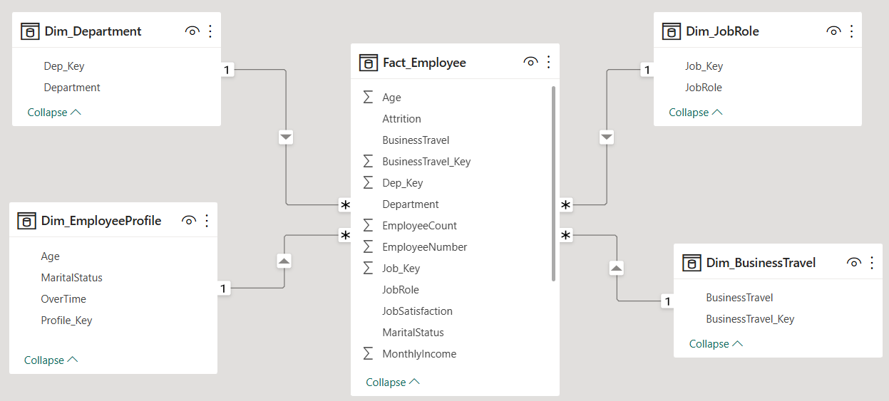
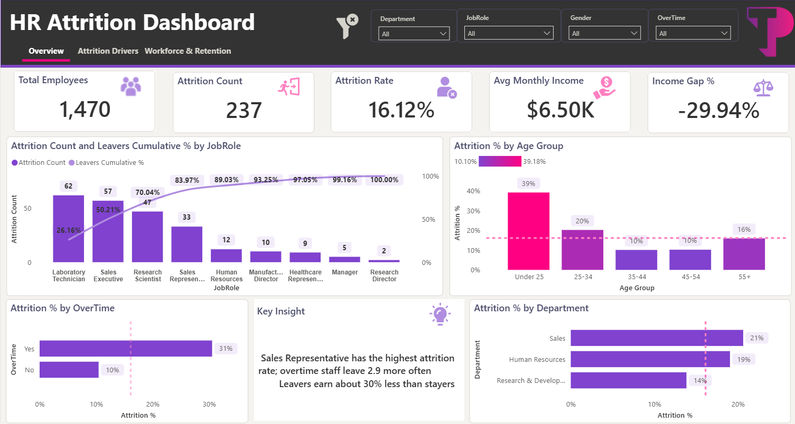
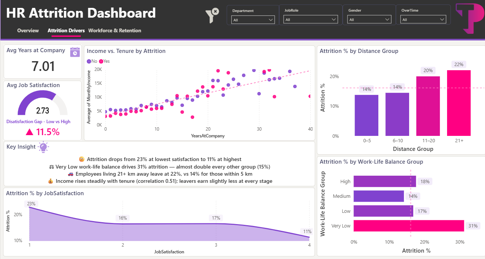
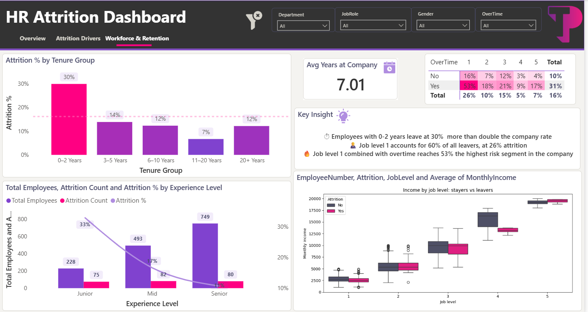

# Teleperformance-Case-study--Bi-Dev
# HR Attrition Case Study

**GBS BI HUB — BI Developer Case Study**
1,470 employees analyzed · 237 leavers · 16.1% company-wide attrition rate

This package contains everything needed to build, present, and defend the HR Attrition Power BI dashboard: the data model, the DAX/Python work, the build guides, the findings, and the presentation deck.

## Quick map: which file for which task

| Task | What it asks | File(s) |
|---|---|---|
| 1 — Data model | Load data, build a star schema | `data/` (11 CSVs) + `01_Build_Guide_PowerBI.md` (Step 1–2) |
| 2 — DAX measures | Measures using variables | `02_DAX_Measures.md` |
| 3 — Trends & outliers | Identify patterns and outliers | `05_Insights_and_Recommendations.md`, Page 2 & 3 of `06_PowerBI_3_Views_Advanced.md` |
| 4 — Dashboard pages | Build the report pages | `01_Build_Guide_PowerBI.md`, `06_PowerBI_3_Views_Advanced.md`, `HR_Attrition_Dashboard_Prototype.html` (visual target), `TP_HR_Theme.json` (brand colours) |
| 5 — Recommendations | Data-backed actions | `05_Insights_and_Recommendations.md` |
| 8 — Python | Junior/Mid/Senior classification | `classify_experience_level.py` |

---

## File-by-file guide

### `data/` — the star schema (Task 1)
Eleven CSVs, already built from the original Excel export: `Fact_Employee` (1,470 rows, keys + numbers only) and ten dimension tables (`Dim_Department`, `Dim_JobRole`, `Dim_EducationField`, `Dim_Education`, `Dim_BusinessTravel`, `Dim_EmployeeProfile`, `Dim_AgeBand`, `Dim_TenureBand`, `Dim_IncomeBand`, `Dim_ExperienceLevel`). Load these into Power BI Desktop directly, or rebuild the model yourself in Power Query following the guide below — `scripts/build_star_schema.py` is the script that generated them, useful as a reference for the transformation logic.

### `01_Build_Guide_PowerBI.md`
Step-by-step, beginner-level instructions to load the data, build the relationships in Model view, sort the band columns correctly, and lay out a first version of the 3-page report.

### `02_DAX_Measures.md`
20+ measures, each with variables (`VAR`/`RETURN`) and a plain-language explanation: attrition rate, company benchmark, overtime risk multiplier, income gap, z-score outlier detection, and a what-if cost scenario.

### `classify_experience_level.py`
Task 8: classifies every employee as Junior (<5 years), Mid (5–9), or Senior (10+) by `TotalWorkingYears`, and prints a two-column summary table. Tested against the original dataset — result: **Junior 228 · Mid 493 · Senior 749** (sums to 1,470).

### `05_Insights_and_Recommendations.md`
The findings in plain language — overtime, tenure, pay, and the Sales Representative outlier — six prioritized recommendations, the caveats worth stating out loud (correlation vs. causation), and a five-minute talk track with likely follow-up questions.

### `06_PowerBI_3_Views_Advanced.md`
A second, more advanced report layout: three pages (Overview, Drivers, Outliers & distributions) including a Pareto chart, a native Scatter chart, and three ways to build a box plot in Power BI (custom visual, Python visual, or a native table of quartiles). This is the version reflected in the final dashboard screenshots and in the presentation deck.

### `TP_HR_Theme.json`
A Power BI theme file in TP brand colours (purple `#8042CF`, pink `#FF0082` for above-benchmark/risk, charcoal `#333333`). Load via View → Themes → Browse for themes.

---

---

----

## Headline numbers (for quick reference)

| Metric | Value |
|---|---|
| Total employees | 1,470 |
| Leavers | 237 |
| Company attrition rate | 16.1% |
| Overtime risk multiplier | 2.9x (30.5% vs 10.4%) |
| Highest-attrition role | Sales Representative (39.8%, statistical outlier) |
| First-year (0–2 yrs) attrition | ~30% |
| Job level 1 + overtime | 52–53% attrition |
| Leaver vs stayer income gap (overall) | ~30% |
| Same-level income gap (e.g. level 1) | ~10% — the overall gap is mostly a seniority effect, not unequal pay |

## Key caveats to state in the presentation

- **No dates in the dataset.** Every "trend" is a trend across tenure, age, or income bands — not across time.
- **Correlation, not causation.** Overtime, seniority, and pay overlap; removing overtime alone won't close the attrition gap.
- **Small groups need care.** Some job-level × overtime combinations (e.g. level 5) have very few people — don't build conclusions on them.
- **Replacement-cost figures are an assumption** (a configurable % of annual pay), not a measured cost.

## Suggested submission order

1. `.pbix` file you build from `01_Build_Guide_PowerBI.md` / `06_PowerBI_3_Views_Advanced.md` + `data/`
2. `HR_Attrition_Presentation.pptx`
3. `03_SQL_Task7.sql`
4. `classify_experience_level.py`
5. Everything else in this package as supporting documentation
